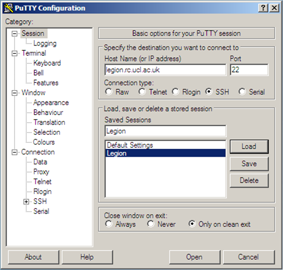
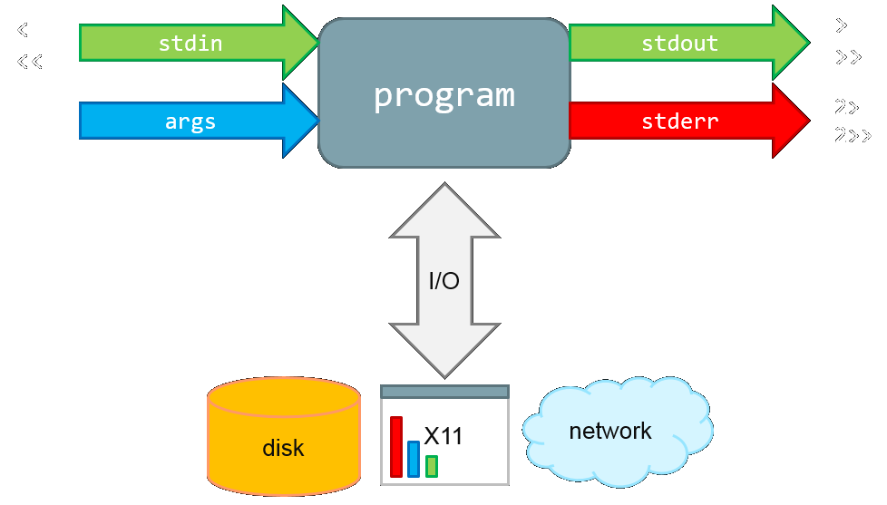
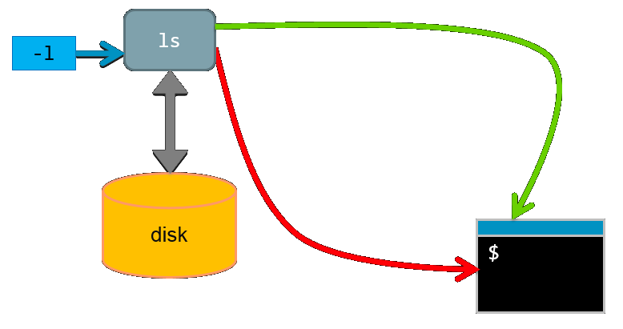
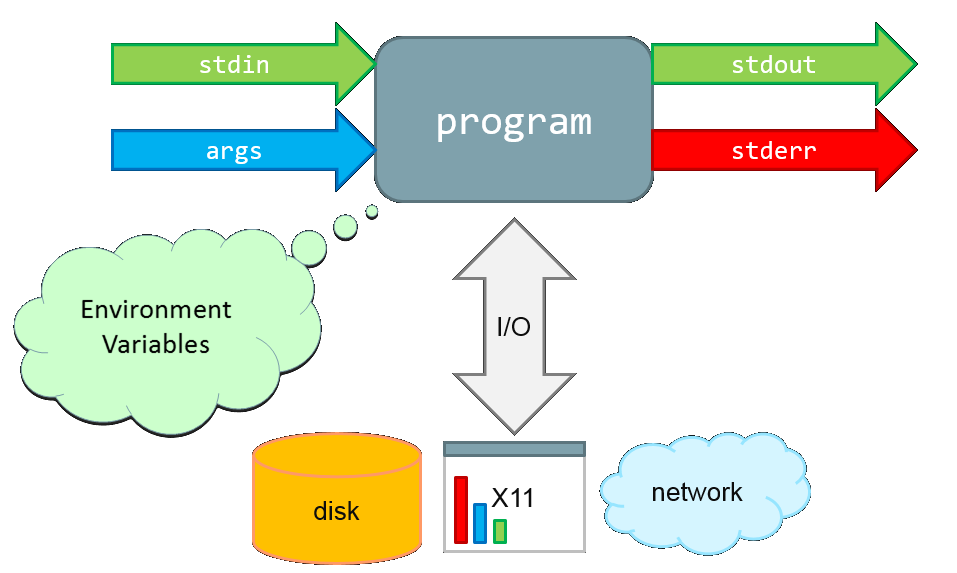

Introduction to the UNIX shell
==============================

Overview
--------

* Navigating the filesystem

* File manipulation

* Wildcards, redirection and piping

* Variables and loops

* File properties and permissions

* Scripts

* And more...

Connecting to a computer: 1970s
-------------------------------


Connecting to a computer: over the Internet
-------------------------------------------


Communication *encrypted!*

Access to Legion
----------------

* To access one of the login nodes (remotely) from a Unix machine:
``` 
ssh <username>@legion.rc.ucl.ac.uk
```

* Log on using UCL username/password

* On Windows (e.g. Desktop@UCL) you can use PuTTY.

Access to Legion
----------------


Access to Legion
----------------



Navigating the filesystem
=========================

Command Prompt
--------------

```
[user@host ~]$
```

* On Legion the command prompt has the form **[&lt;username&gt;@&lt;host name&gt; &lt;present directory&gt;]$**

* **&lt;user name&gt;** is the Unix user name (your UCL user ID).

* **&lt;host name&gt;** is the name of the computer that you are accessing.

* **&lt;present directory&gt;** is the directory that the user is currently in.

* Other systems you log into may have a different form of prompt.

Command Prompt
--------------

* Read evaluate print loop

	+ User types a command and presses enter

	+ The shell *reads* this command, and *evaluates* it

	+ The shell then *prints* any output to the screen and returns the command prompt to the user

Some files to play with
-----------------------
```
[user@host ~]$ git clone https://github.com/tcouch/shell-training.git
```

* Copy this from the slides and right click in the terminal to paste it in.

What's in here?
---------------
```
[user@host ~]$ ls
Scratch  shell-training
```

* **ls** - lists the contents of the current directory

What's over there?
------------------
```
[user@host ~]$ ls shell-training
animals  data  docs  scripts
```

* Give ls the name of a directoty as an *argument* to list the contents of that directory

Hidden files and directories
----------------------------

```
[user@host ~]$ ls -a
.              .bash_logout  Scratch
..             .bashrc       shell-training
.bash_history  .emacs        .ssh
```

* Files starting with "." are hidden
* We have changed the default behaviour of **ls** with a switch, also known as a flag or option
* Always leave a space to separate commands, switches and arguments
* Type ```man ls``` for a list of options you can use with ls (q to quit)

Hidden files and directories
----------------------------

```
[user@host ~]$ ls -a
.	  	.cshrc		shell-training
..		.config		.ssh
.bash_history	.emacs			
```

* **.** - Present working directory (in this case ~)
* **..** - Parent directory to the current directory (in this case /home)

Where am I?
-----------

```
[user@host ~]$ pwd
/home/username
[user@host ~]$
```

* **pwd** (print working directory) - returns the full path to your current working directory
* **~** 'tilde' is shorthand for your home directory
* **/** - the *root* directory
* Note: Windows uses backslashes '\' in paths, everything else uses forward slashes

Filesystem structure
--------------------


Changing directory
------------------

```
[user@host ~]$ pwd
/home/username
[user@host ~]$ cd shell-training
[user@host shell-training]$ pwd
/home/username/shell-training
[user@host shell-training]$ cd ..
[user@host ~]$ cd /
[user@host /]$ 
```

* **cd** - Type *cd* followed by the path to a directory to change into that directory
* **..** - The current directory's parent directory
* **/** - Everything sits under the "root" directory

Absolute path
-------------


/home/alice

* absolute paths always begin with '/'

Relative path
-------------


../home/alice

Absolute and relative paths
---------------------------

There are many ways of writing the path to a directory.

Every directory has a unique absolute path:
```ls /home/username/shell-training/``` 

Relative paths depend on your current location:
```ls shell-training/```

This relative path begins with the home alias and works from anywhere:
```ls ~/shell-training/```

This path works too:
```
cd /bin/../tmp/../home/username/shell-training
```

Tab completion
--------------

* Go to your home directory: ```cd ~```
* What happens if you type ```cd sh``` and then press the *tab* key?

Exercises
---------

The shell-training folder has the following structure:

```
~/shell-training
|--animals
|--data
|--docs
|--scripts
```

1. What is the absolute path to the docs directory? Use the absolute path to change into this directory
2. From there, list the contents of the animals directory using a relative path

Exercises
---------

3. What does typing ```cd``` on its own do? Try typing it from several different locations.
4. What does typing ```cd -``` do? Try typing it from several different locations.


Creating Files and Directories
==============================

Directory creation
------------------

```
[user@host ~]$ mkdir a_directory
[user@host ~]$ ls
a_directory  Scratch  shell-training
```

* Type *mkdir* followed by the name of the directory you want to create.

Directory creation
------------------

```
[user@host ~]$ mkdir b_directory c_directory
[user@host ~]$ ls
a_directory  b_directory  c_directory  Scratch  shell-training
```

* You can create two directories at the same time: just separate the names with a space.

Directory creation
------------------

```
[user@host ~]$ mkdir shell-training/a_directory
[user@host ~]$ ls shell-training
a_directory  animals  data  docs  scripts
```

* You can put the path to an existing directory before your new directory name to create a directory in that location.

Nano: A simple file editor
--------------------------

```
[user@host ~]$ nano a_file
```


* If the file exists nano will open it, otherwise it will open a blank page

Nano
----


* Commands are along the botton of editor screen
* ^ - shorthand for control key
* Type Ctrl-O then Enter to save, Ctrl-X to exit

Other editors
-------------

There are many other (better but more complex) text file editors on the system such as **vim**, **emacs** and **nedit**.

Use the one you feel most comfortable with.

Naming files and directories
----------------------------

* You can use spaces in file and directory names, but this is generally a bad idea as you will have to use quotes whenever you refer to that file.
* Uppercase and lowercase characters are different: FILENAME does not equal filename
* Avoid special characters such as: $:/\,[]{}()!;"'*?<>|
* Filename extensions such as '.txt' or '.pdf' are a convention, not a requirement

A simple script
---------------

* A script is a list of commands, written in a text file, to be run one after another e.g.:

```
[user@host ~]$ nano a_script.sh
```

```
echo "Creating new directory..."
mkdir new_directory
ls
echo "Finished"
```

Running a script
----------------

* You can use the source command to run the script like so:

```
[user@host ~]$ source a_script.sh
Creating new directory...
a_directory   a_script.sh   c_directory     Scratch
a_file        b_directory   new_directory   shell-training
Finished
```

Running a script
----------------

* What happens if you run this script from another directory?

```
[user@host ~]$ cd shell-training
[user@host shell-training]$ source ../a_script.sh
```

Running a script
----------------

* The new directory is created in the current working directory, not the directory where the script file is located.

```
[user@host shell-training]$ source ../a_script.sh
Creating new directory...
a_directory   animals   data   docs   new_directory   scripts
Finished
```

Exercise
--------

Write a script that will do the following steps:
   a. Create a new directory called cake inside your home directory
   b. Use an absolute path to create a directory inside cake called "Cheesecake"
   c. Change into the Cheesecake directory
   d. Use a relative path to create another directory inside cake called "Battenberg"
   e. Return to the home directory and list the contents of cake

   The final set of directories should look like this:
```
~/cake
|--Cheesecake
|--Battenberg
```

Exercise
--------

Read the man page for mkdir to find out what the -p option does. Use it to create the following set of directories with a single command:
```
~/bread
|--focaccia
|--naan
```

Wildcards
=========

Wildcards
---------

```
[user@host shell-training]$ cd docs
[user@host shell-training]$ ls
123.dat    abc.txt  cake.txt        def.txt   r2d2.bot        xyz.txt
abcde.txt  ab.txt   cheesecake.txt  food.txt  some-maths.txt
[user@host docs]$ wc abc.txt def.txt xyz.txt
  10   52  168 abc.txt
   7   61  394 def.txt
  11   99  589 xyz.txt
  28  212 1151 total
```

* ```wc``` counts lines, words and bytes for each file
* We can give wc the names of the files we want to inspect as arguments

Wildcards
---------

```
[user@host docs]$ wc *.txt
  13  119  683 abcde.txt
  10   52  168 abc.txt
   8   83  454 ab.txt
  26  206 1332 cake.txt
  11  105  656 cheesecake.txt
   7   61  394 def.txt
  13   85  561 food.txt
   6   12   56 some-maths.txt
  11   99  589 xyz.txt
 105  822 4893 total
```

* `*` is a wildcard that matches zero or more characters
* Bash automatically expands *.txt into a list of filenames matching that pattern

Wildcards
---------

```
[user@host docs]$ ls a*.txt
abcde.txt  abc.txt  ab.txt
```

* `*` is a wildcard that matches zero or more characters.

Wildcards
---------

```
[user@host docs]$ ls ???.txt
abc.txt	def.txt	xyz.txt
```

* `?` is also a wildcard. It matches a single character.

Wildcards
---------

```
[user@host docs]$ ls [fx]*
food.txt  xyz.txt
```

* Square brackets will match any one of the characters listed inside them.

Manipulating Files
==================

Inspecting files
----------------
```
[user@host animals]$ less birds.txt
```

* **less** - visualise a text file:
    + use arrow keys
    + page up/page down
    + search by typing "/" and press "n" to step through the results
    + quit by typing "q"

Searching files
---------------
```
[user@host animals]$ grep bat mammals.txt
whiskered bat, myotis mystacinus
natterer's bat, myotis nattereri
daubenton's bat, myotis daubentonii
leisler's bat, nyctalus leisleri
brown long-eared bat, plecotus auritus
```

* **grep** - search for lines in a file containing a certain text string

Other file inspection tools
---------------------------

| Command | Action |
|:------- |:---------------------------------------------------------------------- |
| head | visualise the first 10 lines of a file |
| tail | visualise the last 10 lines of a file |
| cat  | print file contents to the terminal screen |
| sdiff | visualise and compare two files side-by-side |

(Use "man &lt;command&gt;" to see more information)


Exercise
--------
Use grep to search through all of the files in the animal directory to find animals with the word red in their name. Read the man page to find out how to make grep only select the word red, and not just any word containing r-e-d.


Copying files
-------------

```
[user@host ~]$ cp a_file copy_of_a_file
[user@host ~]$ ls
a_directory  a_script.sh  bread  cakes.sh     copy_of_a_file  Scratch
a_file       b_directory  cake   c_directory  new_directory   shell-training
```

* **cp** copy a file or directory

Moving/Renaming files and directories
-------------------------------------

```
[user@host ~]$ mv a_file control.in
[user@host ~]$ ls
a_directory  b_directory  cake      c_directory  copy_of_a_file  Scratch
a_script.sh  bread        cakes.sh  control.in   new_directory   shell-training
[user@host ~]$ mv control.in a_directory
[user@host ~]$ ls a_directory
control.in
```

* **mv** - rename or move a file/directory
* It is possible to move and rename a file with one command

Deleting files and directories
------------------------------

```
[user@host ~]$ rm a_directory/control.in
[user@host ~]$ rm a_directory
rm: cannot remove ‘a_directory/’: Is a directory
[user@host ~]$ rm -r a_directory
[user@host ~]$ 
```

* **rm** - delete a file
* **rm -r** - delete a directory and all of its content
* **rm operations are irreversible!!!**
* The -i argument is highly recommended

Aliases
-------
```
[user@host ~]$ alias zap='rm -ri'
[user@host ~]$ zap *_directory
```

* You can create an alias for common commands to make you life easier
* Type **alias** on its own to see what aliases are already set up

Exercise
--------
The docs directory contains several files ending in ".txt". Write a backup script that will create a backups folder and copy each of these files there.

* Run the script
* Delete two of the original text files and use nano to edit another
* Use sdiff to compare the file you've changed with the backed up version
* Read the cp man page to find out how to restore the deleted files from the backup folder without overwriting the changes you have made to the other files

Redirection
===========

Redirecting output to a file
----------------------------
Rather than having the output of a command printed to the screen, we can send it to be written to a file instead.

```
[user@host ~]$ echo hello > hello.txt
[user@host ~]$ echo hello again >> hello.txt
[user@host ~]$ cat hello.txt
hello
hello again
```

* ```>>``` appends the output to the end of an existing file.
* ```>``` will overwrite any existing content.

File inspection revisited
-------------------------
```
[user@host ~]$ cd shell-training/animals
[user@host animals]$ head -n 5 mammals.txt
common pipistrelle, pipistrellus pipistrellus
whiskered bat, myotis mystacinus
natterer's bat, myotis nattereri
daubenton's bat, myotis daubentonii
leisler's bat, nyctalus leisleri
```

* Use an option ```-n``` with head and tail to print n lines from the start or end of a file

The middle?
-----------
What about printing a number of lines from the middle of a file? There's no ```mid``` command!

An inefficient solution:

* Use ```>``` to redirect what would normally be printed to the screen to a file instead
* Save the output from head to a new file
* Use tail to select some lines from the new file

The middle?
-----------

```
[user@host shell-training]$ head -n 15 mammals.txt > temp.txt
[user@host shell-training]$ tail -n 5 temp.txt
european hedgehog, erinaceus europaeus
pygmy shrew, sorex minutus
wood mouse, apodemus sylvaticus
house mouse, mus domesticus
brown rat, rattus norvegicus
```

What if you wanted to do this for 1000 files? What if your work flow involves several intermediate steps? That's a lot of temporary files!

A better solution
-----------------
We can use a pipe to redirect the output from one command and make it the input for another command:
```
[user@host shell-training]$ head -n 15 mammals.txt | tail -n 5
european hedgehog, erinaceus europaeus
pygmy shrew, sorex minutus
wood mouse, apodemus sylvaticus
house mouse, mus domesticus
brown rat, rattus norvegicus
```

Another link in the chain
-------------------------
* **sed** can be used to find and replace words in text

```
[user@host shell-training]$ head -n 15 mammals.txt | tail -n 5 | sed 's/mouse/elephant/g'
european hedgehog, erinaceus europaeus
pygmy shrew, sorex minutus
wood elephant, apodemus sylvaticus
house elephant, mus domesticus
brown rat, rattus norvegicus
```

* Any number of commands can be connected in this way (memory permitting)
* As long as each command takes text input and produces text output
* Even scripts or programs you write yourself

Another link in the chain
-------------------------

You can chain any number of programs together to achieve your goal:


This allows you to build up fairly complex workflows within one command-line.

Exercise
--------

1. Use the wget command to download Alice's Adventures in Wonderland: https://www.gutenberg.org/files/11/11.txt

2. Use less to read the file, search for specific words, and step through the results

3. Use grep to print lines containing a specific word or phrase to the screen
   - e.g. how many times is the Cheshire Cat mentioned?

4. Use sed to replace every instance of Alice with your own name, and redirect the result to a new file.

5. Using a combination of head and tail, find lines 325-335


More about redirection
----------------------

There are three streams of communication between a program and its environment:

* Standard Output (stdout): an output stream where a program writes its data - the default destination is generally the terminal screen.
* Standard Error (sterr): another output stream containing error messages - also printed to the terminal screen by default.
* Standard Input (stdin): default source of a program's input - it is generally the command line.


Output redirection and piping
-----------------------------


Output redirection and piping
-----------------------------




Redirecting StdErr
------------------

```
[user@host docs]$ wc *.txt not_a_file > txt_list 2> txt_list_err
```

* ```2>``` redirects any error messages created by a command

Output redirection and piping
-----------------------------

ls -l



Output redirection and piping
-----------------------------

ls -l > list_of_files


Redirecting input
-----------------

You can also redirect standard input to a command, using ```<``` 
to send the contents of a file in place of command line input.

```
[user@host docs]$ bc < some-maths.txt
3.14285714285714285714
9.99
16.66666666666666666666
10.312567
```

* **bc** allows calculations with floating point numbers.


Variables and Loops
===================

A simple variable
-----------------
```
[user@host ~]$ var1='hello'
[user@host ~]$ echo $var1 world!
hello world!
```

* Don't include spaces either side of the '=' sign.
* Variables can be referenced using the '$' sign and their name.

Quoting variables
-----------------
```
[user@host ~]$ myname="John Smith"
[user@host ~]$ echo "Hello my name is $myname. Nice to meet you."
Hello my name is John Smith. Nice to meet you.
[user@host ~]$ echo 'Hello my name is $myname. Nice to meet you.'
Hello my name is $myname. Nice to meet you.
```

* When using double quotes, bash will scan the contents and expand any variables

Quoting variables
-----------------
```
[user@host ~]$ fruit=orange
[user@host ~]$ echo "I love eating $fruits."
I love eating .
```

Quoting variables
-----------------
```
[user@host ~]$ echo "I love eating ${fruit}s."
I love eating oranges.
```

* In some cases you will need to surround a variable name with braces.

Arithmetic with variables
-------------------------
```
[user@host ~]$ two=2 
[user@host ~]$ result=$(( $two + 2 )) 
[user@host ~]$ echo $result  
4 
[user@host ~]$
```

* Integer arithmetic can be done inside $(( ))
    * \+  addition
    * \-   subtraction
    * /   integer division
    * \*   multiplication

Storing output of commands in variables 
---------------------------------------

Run commands inside **$( )** and assign the wrapped command to a variable

Arithmetic with variables
-------------------------
```
[user@host ~]$ ls 
a_directory  a_file 
[user@host ~]$ dir_contents=$( ls ) 
[user@host ~]$ echo $dir_contents 
a_directory a_file
```
	
Updated process diagram
-----------------------



Special environment variables
-----------------------------

What is the output of this command?

```
[user@host ~]$ echo $PATH
``` 

Note the structure: \<path1\>:\<path2\>:\<path3\>  

PATH is an environment variable which Bash uses to search for commands typed on the command line without a full path. 

Use the command **env** to discover more environment variables.

The for loop
------------

```
[user@host ~]$ for i in first second third
> do
> echo $i iteration
> done
first iteration
second iteration
third iteration
```

* Defines a loop in which the variable "i" will take the values "first", "second" and "third" in that order.
* **do/done** - start and end the loop iteration definition.

	
The for loop using an iterator
------------------------------

```
[user@host ~]$ for (( i=1 ; i<=5 ; i++ ))
> do
> echo iteration$i
> done
iteration1
iteration2
iteration3
iteration4
iteration5
```

(Note how it is possible to create number labels)

Exercise
--------

* In the docs directory, create a variable called *files* listing all of the text files.
* Loop through this list and print out the first line from each file.

Exercise
--------
* Use a for loop to create five directories called calculation_?, where ? is a number.
* Use a loop to create five directories, each one the parent of the next.


File properties and permissions
===============================

File properties
---------------

```
[user@host ~]$ ls -l
total 368
-rw-r--r-- 1 course1 ucaac2 167546 Jan 25  2014 11.txt
-rw-r--r-- 1 course1 ucaac2     72 Jun  6 12:34 a_script.sh
drwxr-xr-x 4 course1 ucaac2   4096 Jun  6 12:43 bread
drwxr-xr-x 4 course1 ucaac2   4096 Jun  6 12:41 cake
...
```

* **ls -l** - list file properties (details)

File properties
---------------

```
drwxr-xr-x 4 course1 ucaac2   4096 Jun  6 12:43 bread

        drwxr-xr-x      - File type and permissions
        4               - Number of links to the file
        course1         - User name of file owner
        ucaac2          - Group to which the file belongs 
        4096            - size of file in bytes
        Jun 6           - last change date
        12:43           - last change time
        bread           - file name
```

File permissions
----------------

* There are three user security classifications that apply to the ownership of a file:

    + **user:** the individual user that has ownership of the file

    + **group:** a group of users to which that user belongs

    + **others:** all other users (not owner or in that group)

* Each of these has three file access classifications:

    + **read:** permission to read the file

    + **write:** permission to write the file

    + **execute:** permission to execute (run) the file

File permissions
----------------

**drwxr-xr-x** has four fields:

|  |  |
|:-----|:--------------------------------------------|
| d    | The file is a directory                     |
| rwx  | The user has read, write and execute access |
| r-x  | The group has read and execute access       |
| r-x  | Others have read and execute access         |


| Permissions | read | write | execute |
|:------------|:----:|:-----:|:-------:|
| rwx         | yes  | yes   | yes     |
| rw-         | yes  | yes   | no      |
| r--         | yes  | no    | no      |
| r-x         | yes  | no    | yes     |
| ---         | no   | no    | no      |

File permissions
----------------

```
[user@host ~]$ ls -l 
drwxr-xr-x 4 course1 ucaac2   4096 Jun  6 12:43 bread
[user@host ~]$ chmod go-rx bread
[user@host ~]$ ls -l 
drwx------ 2 user rcops 4096 2009-12-08 07:31 a_directory
```

* **chmod** - change the permissions of a file

File permissions
----------------

How did the permissions definition go-rx work?

```
chmod [ugoa][+/-][rwx] file
```

* ugoa - user, group, other, all

* +/- - add/remove

* rwx - read, write, execute

If you don't specify u,g,o or a, default is **ALL** (so chmod +x makes file executable for everyone).

What groups am I in?
--------------------

```
[user@host ~]$ groups
ucaac2 legon020
```

Exercise:
---------
* Find a partner who is in the same group as you. Use the **groups** command to check.
* In your home directory, create a new directory and give members of your group write access to it, but take away read access.
* Tell your partner the absolute path to the directory you've given them write access to.
* Share files by copying them to each other's shared directories.

Exercise
--------

The data folder contains 200 files. Each file is named according to a type of measurement (A or B), and a location (1-100) e.g. A_21, B_56 etc. The scripts folder contains a python script which takes the names of an A and a B file as arguments e.g. scripts/calculate_score.py data/A_1 data/B_1
This will calculate a score based on the data in the two files and print it to standard output along with the name of the files used.

1. Make calculate_score.py executable

2. Use a for loop to run through the data files corresponding to each location and generate a score

3. Modify the for loop to save the scores to a file

4. Use the sort command to find the location with the highest score

Shell Scripting
===============

Shell scripting
---------------

So far we've been using **source** to run our scripts, but it's also possible to make them executable - just like commands.

Step 1: The Interpreter Directive
---------------------------------

```
#!/bin/bash
# This is a very simple hello world script.
echo "Hello, world!"
```

* \#! - is used to indicate which program should be used to interpret the script
  + In this case it's bash, it could also be a language like python, perl, ruby etc.
  + This must be the first line in the script
* \# - a comment (ignored by /bin/bash)


Step 2: Making it executable
----------------------------

```
[user@host ~]$ chmod u+x hello_world.sh
[user@host ~]$ ls -l hello-world.sh
-rwxr--r-- 1 user ccaas0 30 Mar 31 17:10 hello_world.sh
```

* Use **chmod** to change permissions on the script and make it executable

Step 3: Location
----------------

```
[user@host ~]$ ./hello_world.sh
hello world!
```

* What's with the "./" ?
* Remember the PATH!


Changing the PATH
-----------------
If you want to be able to make your script work like a command, you need the directory it is in to be in your PATH

```
[user@host ~]$ mkdir ~/scripts
[user@host ~]$ PATH=$PATH:$HOME/scripts
[user@host ~]$ export PATH
```

* Create a directory in your home directory specifically for your scripts
* Add this directory to the PATH environmental variable
* Make sure the scripts you want to use are executable


Command line arguments
----------------------

You can control your script's behaviour with arguments you pass to it when you run it.

```
[user@host ~]$ ./script.sh var1 var2
```

Within the script:
$1 contains "var1"
$2 contains "var2"

Command line arguments
----------------------

The script looks like this:
```
#!/bin/bash

echo The first argument is $1
echo The second argument is $2
echo And together they make ${1}${2}
```

And here it is in use:
```
[user@host ~]$ ./var-script green house
The first argument is green
The second argument is house
And together they make greenhouse
```

Exercise
--------

You can now control the number of times a for loop iterates by including a number as an argument when you call it. 
Write a script which will create as many numbered directories as you want when you run it.

Exercise
--------

1. Create a bash script called hi which will use the USER environment variable to say hello to you

2. Make this script executable

3. Create a /scripts directory in your home directory

4. Add this directory to the PATH environment variable

5. Move the new script there and try running it as a
   command

Login Scripts
=============

Variables are temporary
-----------------------

* If you close PuTTY and log back in, you'll find your changes to PATH and any aliases you created have gone.
* You'll need to set them all up again if you want them to work.
* If you put them in a login script, they'll be setup every time you login.

Those dot files
---------------

Remember those hidden files in your home directory? Some of them are actually pretty useful.

* **.bash_profile** is a script that runs every time you log in to the system
* **.bashrc** is a script that runs every time you start a new interactive shell
* It's quite common for .bash_profile to include a command to run .bashrc automatically

Both of these are already set up for you on Legion, but you can improve them as you like.

Exercise
--------

1. Edit your .bash_profile script in your home directory and include some commands to be run when you log in. For example:
  * alias
  * cal
  * echo "Welcome back $USER"
  * PATH=\$PATH:\$HOME/scripts && export PATH

2. Close PuTTY and log back in.

3. Now edit .bashrc to report $SHLVL when you start a new instance of bash


Archiving and transferring files
================================

Archiving and compression
-------------------------

```
[user@host ~]$ tar -czvf work.tgz work
work/
work/program/
work/calculations/
work/calculations/control.in
work/workfile
```

* **tar -zcvf** - archives and compresses directory trees and files 
    + **c** - create archive 
    + **z** - compress
    + **v** - verbose
    + **f** - in the following file

Accessing another system
------------------------

Use the **ssh** command to login to other systems you have access to

```
[user@host ~]$ ssh <username>@aristotle.rc.ucl.ac.uk
```

* Type Ctrl-D or logout to return to Legion

Transferring files across a network
-----------------------------------

To Aristotle:

```
[user@host ~]$ scp work.tgz <username>@aristotle.rc.ucl.ac.uk:
...
Password:
work.tgz         100%  213     0.2KB/s   00:00
```

* remember to put the colon at the end!

Extracting files from a compressed archive
------------------------------------------

```
[user@host ~]$ tar -xzvf work.tgz 
work/
work/program/
work/calculations/
work/calculations/control.in
work/workfile
```

* **tar -z*x*vf** - extracts and uncompresses directory trees and files 
    + **x** - extract archive 
    + **z** - uncompress
    + **v** - verbose
    + **f** - from the following file

Transferring files across a network
-----------------------------------

From Aristotle:

```
[user@host ~]$ scp <username>@aristotle.rc.ucl.ac.uk:~/work.tgz .
...
Password:
work.tgz         100%  340     0.3KB/s   00:00
```

* . means copy to this directory


Exercise
--------

1. Use tar to create an archive of the shell-training directory

2. Use scp to copy the archive to Aristotle: aristotle.rc.ucl.ac.uk

3. Extract the archive file on Aristotle

4. Use scp to copy a file from Aristotle to your home directory

Process control
===============

Process control
---------------

* A process is in the:

    + **foreground** when it is interacting with the user via an interface (usually the shell).

    + **background** if it is running without interacting with the user. 

    + **suspended** if it is neither interacting nor running.

* To run a process in the background:
add the symbol "&" at the end of the command line.

* To send a foreground process to the backgound:
press Ctrl+z and then execute the command "bg"

* To bring a background process to the foreground:
execute the command "fg"

Which processes are running?
----------------------------

Use the **jobs** command

```
[user@host ~]$ sleep 60 &
[1] 24991
[user@host ~]$ jobs
[1]+  Running                 sleep 60 &
```

Or **ps** for more information

```
[user@host ~]$ ps
   PID TTY          TIME CMD
 24467 pts/6    00:00:00 bash
 24991 pts/6    00:00:00 sleep
 24996 pts/6    00:00:00 ps
```

Killing processes
-----------------

Use the **kill** command with the PID:

```
[user@host ~]$ kill 24991
[1]+  Terminated              sleep 60
```

Or use the job number:

```
[user@host ~]$ kill %1
[1]+  Terminated              sleep 60
```

More information
----------------

* Many topics not covered here:
    + if statements
    + case switches
    + defining functions
    + and many, many more...

* Google and the **man** pages are your friends!


GNU Screen
==========

Intro to GNU Screen
-------------------

**Q: What happens if you want to:**

Log out and turn off your PC?

Go home and continue working?

Freely create and delete shell sessions within one terminal?

**A: Use a terminal multiplexer like GNU screen**

First, log into Aristotle
-------------------------

```
ssh user@aristotle.rc.ucl.ac.uk
```

(or use Putty)


* Take a note of which login node you are assigned!

Then, run "screen"
------------------

```
screen
```

The screen will clear and you will be presented with a new prompt.


Do something in that shell (e.g.) "ls".

Creating new shells in Screen
-----------------------------

* Press **Ctrl-a**, then press **c**

* You'll be given another shell (what screen calls a "window")!


* Create new "windows" with **Ctrl-a, c**

* **Ctrl-a, a** switches between this window and your last one.

* Windows are numbered 0->N, **Ctrl-a, number** (e.g. **Ctrl-a, 3**) to switch to a particular one.


Detaching from your session
---------------------------

* **Ctrl-a, d** detaches from your session.


* **screen -r** re-attaches.

Log out
-------

* You can log out of a machine you have a detached session on and programs will keep running.


Logging back in
---------------

* Then log back in (from anywhere!) and **screen -r** to re-attach.


Logging back in
---------------

* Then log back in (from anywhere!) and **screen -r** to re-attach.


**NOTE:** make sure you log into the same login node that you started screen on


Other screen commands
---------------------

* **screen -d** - forces detach of a screen that's running (so you can screen -r it).  Handy if your SSH connection drops.

* **screen -ax** - forces attach to a screen that's attached to from somewhere else.

* You can configure screen in lots of useful ways, including changing the keyboard shortcuts.

* For more see man pages, or online documentation: [(http://www.gnu.org/software/screen/)](http://www.gnu.org/software/screen/)


More useful shell commands
==========================

Formatted sequences based on numbers
------------------------------------

```
[user@host ~]$ seq 1 5
1
2
3
4 
5
```

* **seq** - generates sequences based on numbers

Formatted sequences based on numbers
------------------------------------

```
[user@host ~]$ seq 1 2 9
1
3
5
7
9
```

* **seq** - generates sequences based on numbers

Formatted sequences based on numbers
------------------------------------

```
[user@host ~]$ seq -f %03g 1 2 9
001
003
005
007
009
```

* **g** - the number of significant digits is 3 
* **0** - in front of 3 indicates that the number is padded with zeros if smaller than 100.
* **%** - start the format definition for the number (place the number)

Links
-----

* Created with "ln"

* Two types:
    + "Hard" - indistinguishable from files
    + "Soft" (or "Symbolic") - like a shortcut

Hard links
----------

* Inode table keeps track of hard links

* Deleting a file = "unlinking" it

* Can only be used inside a single file system

Soft links
----------

* Shortcut, e.g.

```
[user@host ~]$ ln -s ~/some_project/2012/part531 ~/current_project
[user@host ~]$ ls -l ~ 
lrwxr-xr-x  1 user  staff  11 10 Oct 17:56
               current_project -> /home/user/some_project_2012/part531
```

* Can use relative or absolute paths!

* Create using absolute paths to make sure they go where you want

Generating scripts with scripts
-------------------------------

```
cat <<EOF > child_script.sh 
#!/bin/bash 
echo The child script says Hi! 
EOF 
```

* **\<\<EOF** - concatenates the text until the string "EOF", redirecting it to cat
* **\> child_script.sh** - redirects the output of cat to child_script.sh.
* It may be tempting to indent things - DON'T!

Exercise:
--------

* write a parent_script.sh that creates and executes 
the child_script.sh

* write a parent_script.sh that creates and executes 
10 different child_script.sh that print out their individual number
